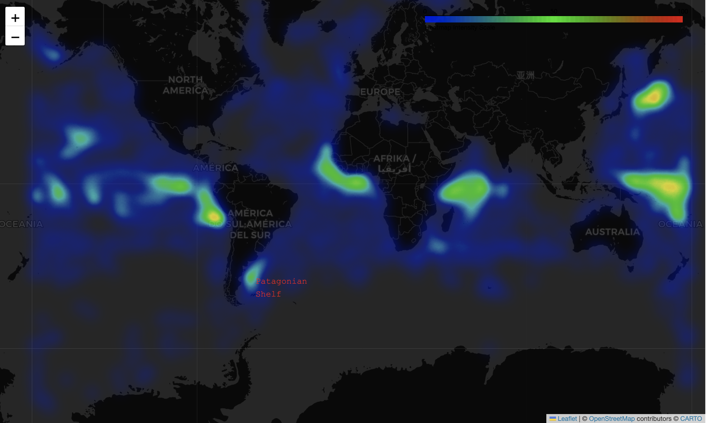
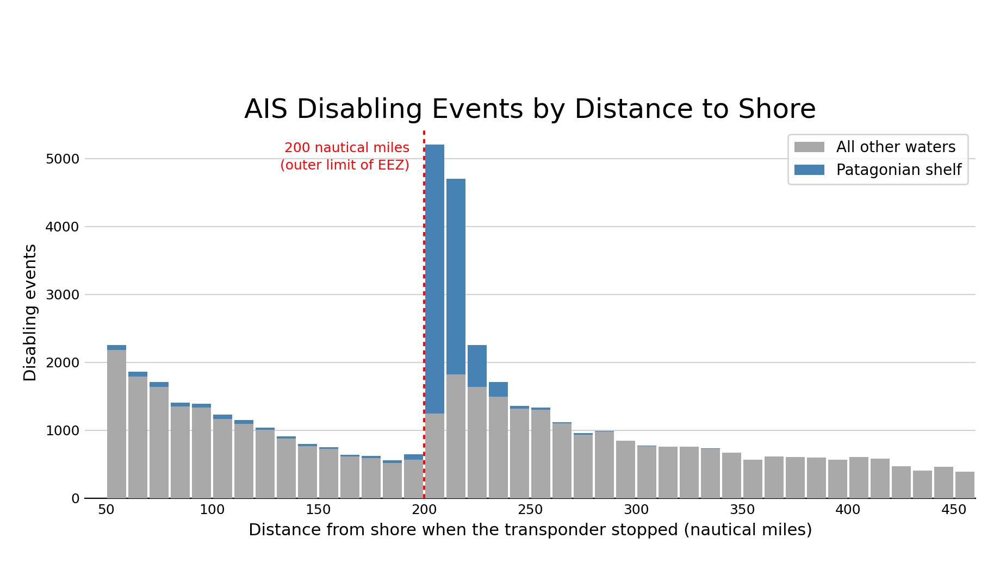
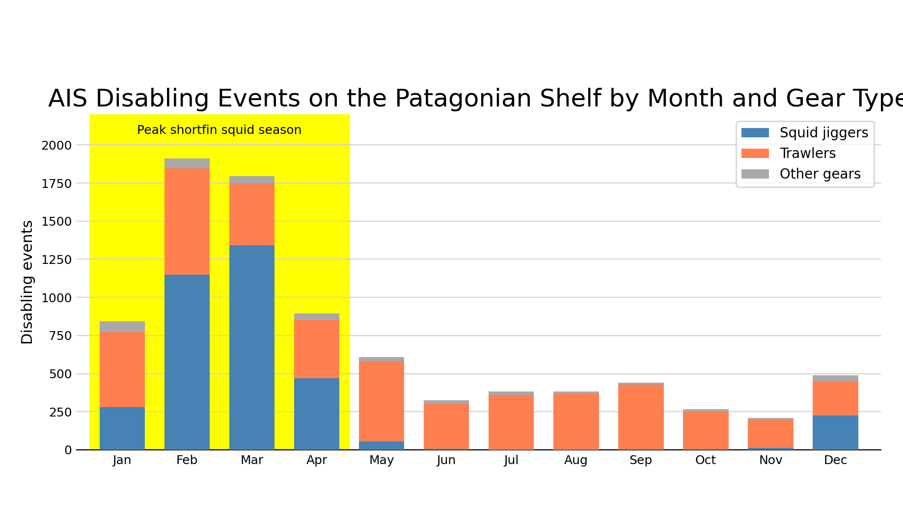

# Red Flag!: Spotting Potential Illegal Fishing Activity Using AIS Outage Data

Data storytelling project — Master of Data Science, University of Pittsburgh.
Analysis of 55,368 AIS disabling events published by Global Fishing Watch (2017–2019).

**[Read the full data story →](https://cmckean2018.github.io/Spotting-Potential-Illegal-Fishing-Activity-Using-AIS-Outage-Data/McKean_Data_Story.html)**

## Figures

### 1. Visualizing 'Hot Spots'
Outages concentrate into a handful of specific places rather than spreading evenly across fishing grounds.

[]
**[Open the interactive map →](https://cmckean2018.github.io/Spotting-Potential-Illegal-Fishing-Activity-Using-AIS-Outage-Data/figures/figure1_map.html)**

### 2. Vessels go dark near EEZ boundaries
9,905 events begin in the 20 nautical miles just outside the 200-nautical-mile limit, against 1,202 in the 20 nautical miles just inside — roughly eight times as many on the seaward side. Equipment faults and satellite coverage gaps have no way of knowing where a legal boundary sits.

### 3. AIS disabling events align with the seasonality of fisheries
Squid jiggers put 84% of their outages into February–April, then effectively stop: one event in July against 1,342 in March. Trawlers fishing the same water under the same satellites hold steady all year. Reception gaps are gear-blind, which is what rules out a purely technical explanation.

## An important caveat

Disabling AIS is not proof of illegal fishing. Transponders fail, satellite coverage has gaps, and vessels sometimes go dark for legitimate reasons including piracy avoidance and protecting productive fishing locations. These figures provide recommendations for where increased surveillance would be the most productive, not where illegal activity has been established.

## Data

Global Fishing Watch AIS disabling events, 2017–2019: 55,368 events from 5,269 commercial fishing vessels. Gaps shorter than 12 hours and those beginning within roughly 50 nautical miles of shore are excluded by the data provider. The source CSV is not included here, you can download it from Global Fishing Watch.

## Contents

- `McKean_Data_Story.ipynb` — full analysis
- `McKean_Data_Story.html` — rendered version of the notebook
- `figures/` — exported figures and the interactive map

## Tools

Python · pandas · NumPy · matplotlib · folium
